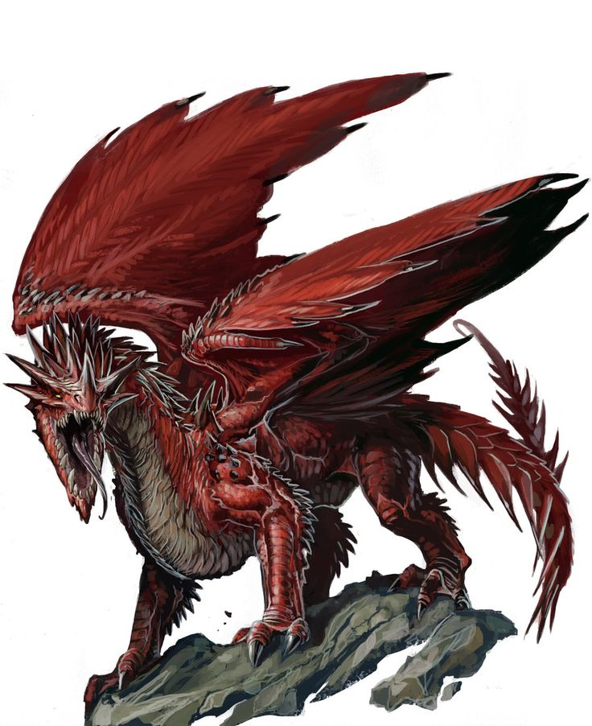

# Monster AutoBattle

### Beaker project 1

An autobattling game where you can select a monster from D&D and witness it battling a monster of similar challenge rating. [Open5e](https://open5e.com/ "Open5e API")'s public API is used to retrieve monster data from Wizards of the Coast's Dungeons & Dragons 5th Edition SRD.

[Link to the live site.](https://monster-autobattle.netlify.app/ "Monster AutoBattle live site hosted on Netlify")

***

## Technologies Used

#### HTML

HTML creates the landing page, which includes:
- a brief introduction
- a "Start Game" button
- a footer linking to my personal GitHub page

Further HTML is generated purely by JQuery

#### CSS

CSS styles nearly every element of the page. Some notable CSS tools used are:
- CSS animations for fading in elements and battle effects
- Responsive measurements such as vmin, percents, and em
- Media Queries to apply some light formatting changes to small screens

#### JavaScript

JS is the bulk of the application. It implements the classes, objects, and data behind the entire gameplay operation. See the Approach Taken section for a detailed breakdown of how JS is used.

#### JQuery

JQuery creates (and destroys) nearly every visible element of the application, besides the header, footer, introduction, and Start Game button. Here are some of the many JQuery methods involved along the way:
- .append() & .remove()
- .insertBefore() & .insertAfter()
- .addClass() & .attr()
- .css()

Notably, the Ajax call made to Open5e's public API is implemented with JQuery. This retrieves the data used to construct the monsters.

***

## Approach Taken

To implement the gameplay, first I needed an approach to match the data from the Open5e with the images I collected for various monsters. A massive array named `monsterManual` holds all of the monster names I have images for and their challenge rating. A JavaScript class named `MonsterGroup` is instantiated whenever a new group of monsters of a certain challenge rating is needed. It uses the names from monsterManual to create an array of monster image filepaths, and finally makes the ajax call to Open5e to retrieve the data detailing each monster's stats. After construction, the group contains three matching arrays: `this.monsterNames`, `this.monsterImgs`, and `this.monsterData`. These arrays line up so the indexes match. For example, this.monsterNames[0], this.monsterImgs[0], and this.monsterData[0] would all refer to the same monster.

With the data now properly organized, the basic loop of the game can be understood:
1. The next monster group is constructed (starting with the lowest challenge rating) and assigned as the `currentGroup`.
2. The currentGroup is used to construct the carousel of monster choices.
3. The player selects a monster to enter into battle.
4. A different monster from the currentGroup is randomly chosen to be the enemy, the carousel is removed and the battle screen is built.
5. The battle commences.
    1. First, the `startBattle` function is used to decide which monster goes first (based on an [initiative roll](https://www.dandwiki.com/wiki/5e_SRD:Initiative "Explanation of initiative on D&D wiki")).
    2. The `handleAttack` function is called and the appropriate monster attacks, potentially damaging its opponent (based on the attacker's primary [attack](https://www.dandwiki.com/wiki/5e_SRD:Making_an_Attack "Explanation of making an attack on D&D Wiki") and the defender's [armor class](https://www.dandwiki.com/wiki/SRD:Armor_Class "Explanation of armor class on D&D wiki")).
    3. If the target of that attack still lives, repeat substeps 2 & 3 for the other monster. Otherwise, proceed to step 6 below.
6. A modal appears, declaring if the player won or lost the round. If they won, a "Proceed" button allow them to advance to the next monster group. If they lost, a "Restart" button resets the next monster group to the lowest challenge rating. Either way, the batle screen is removed and this loop then continues from step 1.

***

## Future Features

Some features I would like to implement in the future:
- Multiattack: many monsters in D&D are severely weaker than they should be without factoring in the multiattack option.
- Special abilities: similarly, many monsters are not brutish melee combatants, and as it stands the game has no way to use special abilities such as spellcasting. This would be a major but extrememly desirable undertaking.
- Currently, local storage only saves the player's current progress, reseting upon a loss. I would like to save the player's all time furthest progress, and allow the player to start a new game from any challenge rating they've already beaten at least once.
- Another use of local storage would be to keep track of individual wins and loses per monster, and assemble a "Statistics" screen detailing how every monster has performed in a given player's history. Other statistics might include win/loss percent for the player, or average length of game (how many rounds completed before loss, on average).
